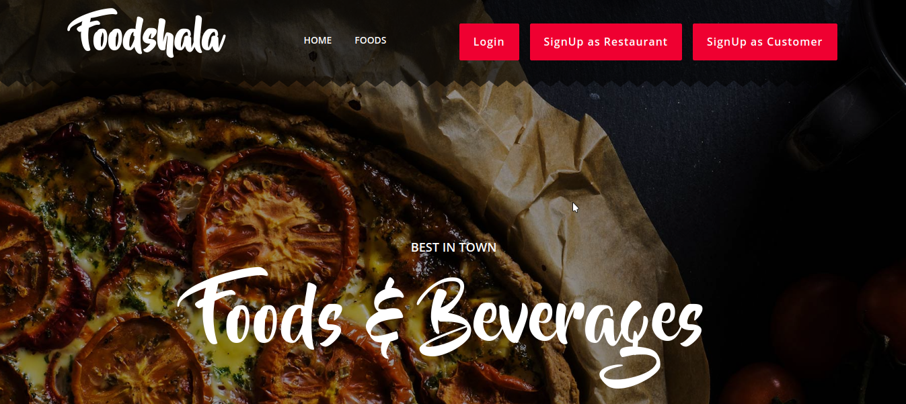
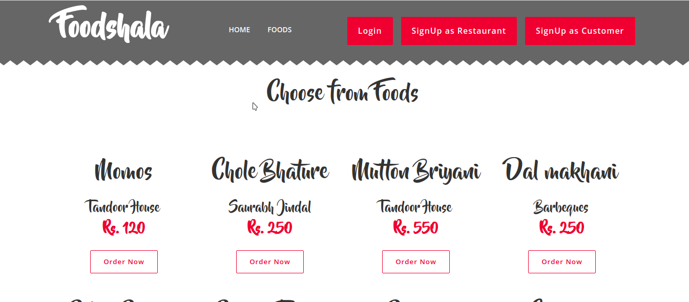
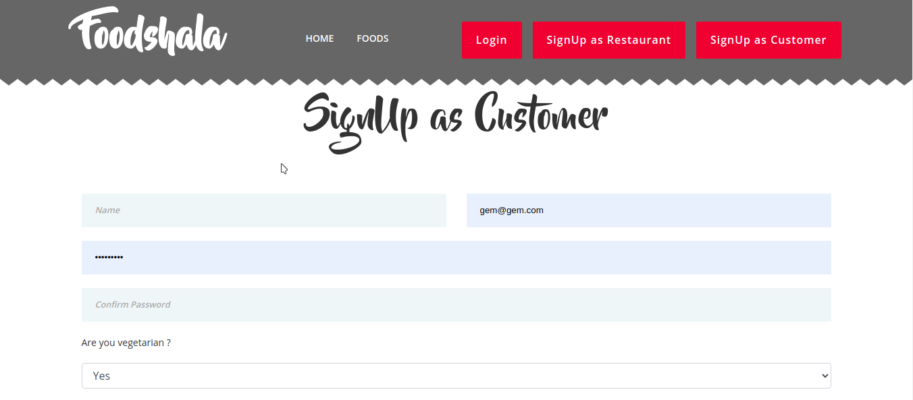

# Foodshala

###### I have tried to make this app secured the XSS Attack

### Foodshala Structure
###### To use this website make a database and import foodshala sql file and configure the database settings in "application/config/database.php". The website is live on heroku : https://foodshala-intern.herokuapp.com/

###### 1. This website is divided into 3 models (Food, Users, Order).
###### 2. These models are controlled by 2 Controllers Users and Foods.
###### 3. Then there are views which are used to render all the data.
###### 4. Static files are used in "assets" folder to serve static content. 
 
 

